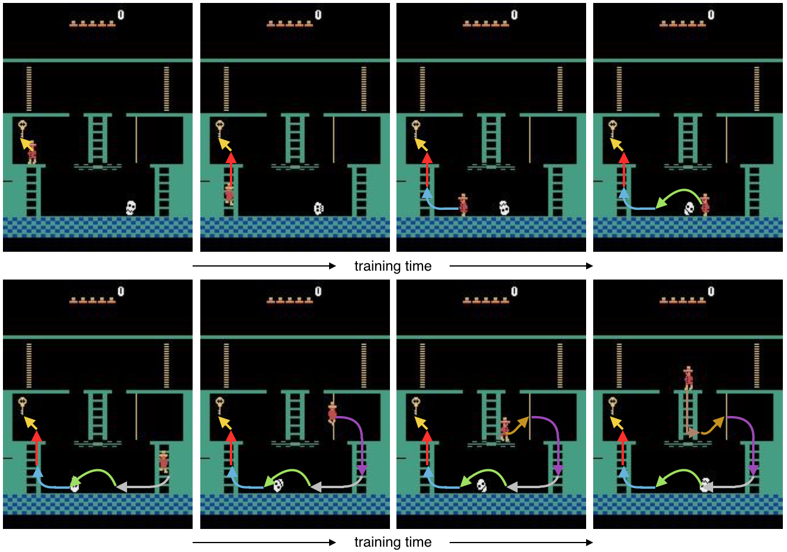
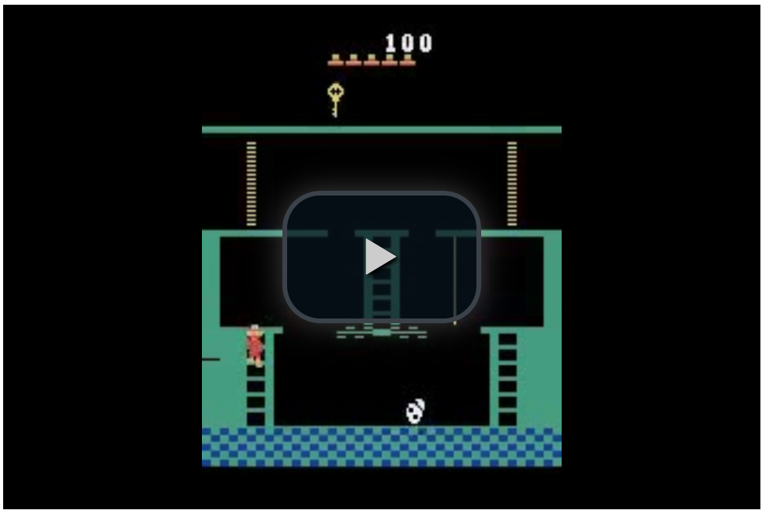

# Learn RL policies on Atari by resetting from a demonstration

Codebase for learning to play Atari from demonstrations. Contrary to other work on learning from demonstrations we learn to maximize the score using pure RL, rather than trying to imitate the demo.

All learning is done through RL on the regular Atari environments, but we automatically build a curriculum for our agent by starting the rollouts from points in a demonstration provided by a human expert: We start by having each RL episode begin near the end of the demonstration. Once the agent is able to beat or at least tie the score of the demonstrator on the remaining part of the game, in at least 20\% of the rollouts, we slowly move the starting point back in time. We keep doing this until the agent is playing from the start of the game, without using the demo at all, at which point we have an RL-trained agent beating or tying the human expert on the entire game.

*Impression of our agent learning to reach the first key in Montezuma’s Revenge using RL and starting each episode from a demonstration state. When our agent starts playing the game, we place it right in front of the key, requiring it to only take a single jump to find success. After our agent has learned to do this consistently, we slowly move the starting point back in time. Our agent might then find itself halfway up the ladder that leads to the key. Once it learns to climb the ladder from there, we can have it start at the point where it needs to jump over the skull. After it learns to do that, we can have it start on the rope leading to the floor of the room, etc. Eventually, the agent starts in the original starting state of the game and is able to reach the key completely by itself.*

# Replaying demo transitions

When resetting to a state from the demonstration and when using recurrent policies, we need to make sure that the hidden state of the agent accurately reflects the recent game history: simply resetting the state to zero is not sufficient. At every episode we therefore recompute the hidden state from the last few transitions in the demonstration preceding the selected starting state.

# PPO implementation

Our PPO implementation is derived from the one in [OpenAI Baselines](https://github.com/openai/baselines). We use [generalized advantage estimation](https://arxiv.org/abs/1506.02438v5) with a lambda of 0.95 and gamma between 0.999 and 0.9999. For every minibatch we process during training we recompute the hidden state of our policy at the start of that minibatch, rather than just using the value we had computed using the previous set of parameters: effectively this comes down to using a larger minibatch in the time dimension, and throwing away the first part of the batch when calculating the value loss and policy loss.

# How to use

Training is performed using the `train_atari.py` script. The code uses MPI (using [Horovod](https://github.com/uber/horovod)) for distributed training. We recommend running on at least 8 GPUs, preferably more: we used 128 for Montezuma. The default hyperparameter settings work well for Montezuma. When training stops making progress you should lower the learning rate and entropy coefficient to help the agent get unstuck.

# Results

So far we have been able to train an agent to achieve a high score of 74,500 on Montezuma's Revenge from a single demonstration, better than any previously published result. The resulting policy is reasonably robust, achieving a score of 10,000 when evaluating with [sticky frames](https://arxiv.org/abs/1709.06009v2) and 8,400 with epsilon greedy noise where epsilon=0.01, also the best published so far.

  

*Our agent playing Montezuma’s Revenge. The agent achieves a final score of 74,500 over approximately 12 minutes of play (video is double speed). Although much of the agent’s game mirrors the demonstration, the agent surpasses the demonstration score of 71,500 by picking up more diamonds along the way. In addition, the agent learns to exploit a flaw in the emulator to make a key re-appear at minute 4:25 of the video, something not present in the demonstration.*

The trained model for Montezuma's Revenge can be downloaded [here](https://www.dropbox.com/s/nr4jmjcpsrrsgwf/003100?dl=1).

# Remaining challenges

The algorithm is still fragile: some runs don't converge for Montezuma's Revenge, and the one that did converge required running at large scale, with a restart from a checkpoint halfway. We have not yet been able to match expert performance on Gravitar and Pitfall.

# The demos

The repo includes demos for Montezuma's Revenge, PrivateEye, Pitfall, Gravitar, and Pong. These demonstrations were obtained by playing tool-assisted using [this code](https://github.com/openai/atari-demo).

# Related work

Our main insight is that we can make our RL problem easier to solve by decomposing it into a curriculum of subtasks requiring short action sequences; we construct this curriculum by starting each RL episode from a demonstration state. A variant of the same idea was used recently for [reverse curriculum generation for robotics](http://bair.berkeley.edu/blog/2017/12/20/reverse-curriculum/), where a curriculum was constructed by iteratively perturbing a set of starting states using random actions, and selecting the resulting states with the right level of difficulty.

Starting episodes by resetting from demonstration states was [previously proposed](https://arxiv.org/abs/1607.05077v1), but without constructing a curriculum that gradually moves the starting state back from the end of the demonstration to the beginning. When combined with imitation learning, [several](https://arxiv.org/abs/1804.02717) [researchers](https://arxiv.org/abs/1709.10089) report benefit from this approach. For our use case we found such a curriculum to be vitally important for deriving benefit from the demonstration.

Recently, DeepMind has shown an agent learning Montezuma's Revenge by imitation learning from a demonstration; [one approach](https://arxiv.org/abs/1805.11592v1) trains an agent to achieve the same states seen in a YouTube video of Montezuma's Revenge, and [another technique](https://arxiv.org/abs/1805.11593v1) combines a sophisticated version of Q-learning with maximizing the likelihood of actions taken in a demonstration. The advantage of these approaches is that they do not require as much control over the environment our technique does: they do not reset the environment to states other than the starting state of the game, and they do not presume access to the full game states encountered in the demonstration. Our method differs by directly optimizing what we care about, the game score, rather than making the agent imitate the demonstration; our method does not have the problem of overfitting to a sub-optimal demonstration and could offer benefits in multi-player games where we want to optimize performance against other opponents than just the one from the demonstration.
